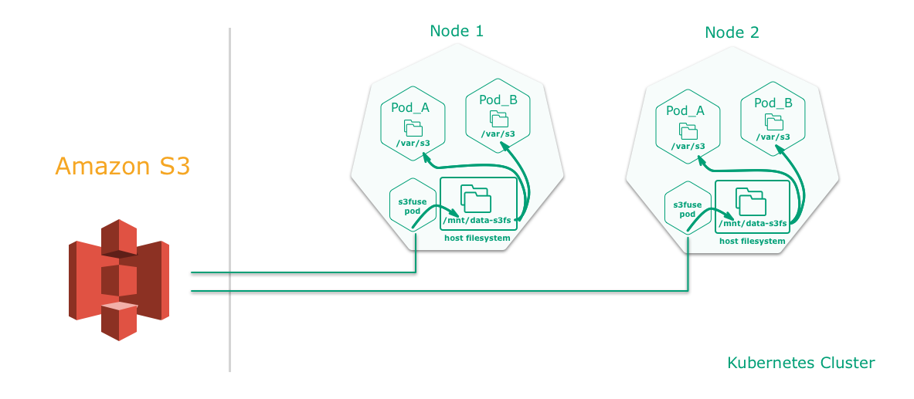

## Shared storage with S3 backend
The storage is definitely the most complex and important part of an application setup, once this part is 
completed, 80% of the tasks are completed.

Mounting an S3 bucket into a pod using FUSE allows you to access the data as if it were on the local disk. The 
mount is a pointer to an S3 location, so the data is never synced locally. Once mounted, any pod can read or even write
from that directory without the need for explicit keys.

**But as mentioned above - the data is not mirrored locally. As a result, read/write operations always go over the 
network and are correspondingly slow.**

However, it can be used to import and parse large amounts of data into a database.

### Overview

